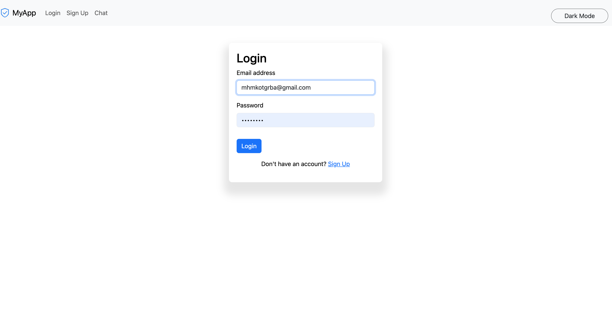
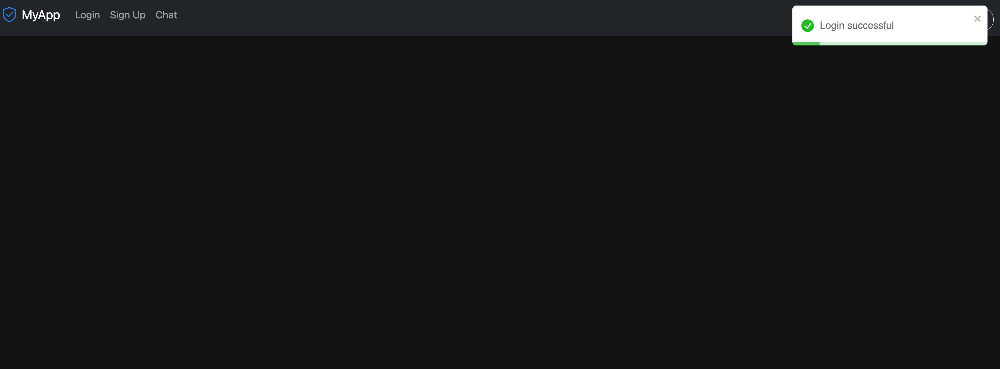
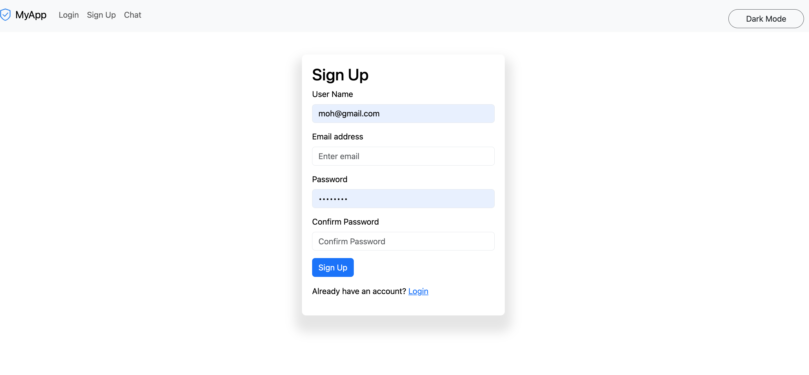

<p align="center">
  <a href="https://nestjs.com/" target="blank"></a>
</p>
<p align="center">
  <a href="https://www.npmjs.com/package/your-package" target="_blank"></a>
  <a href="https://www.npmjs.com/package/your-package" target="_blank"></a>
  <a href="https://www.npmjs.com/package/your-package" target="_blank"></a>
</p>
<p align="center">
  A powerful backend application with authentication and SendGrid integration.
</p>
Description
This backend application is built with NestJS and provides a robust authentication system. It integrates with SendGrid for email functionalities such as user registration and verification.

Features
Authentication System: Register and log in users with secure password hashing.
Email Verification: Send verification emails using SendGrid.
JWT Authentication: Issue and validate JWT tokens for secure API access.
# Installation
```bash
# Clone the repository
$ git clone https://github.com/yourusername/your-repository.git

# Install dependencies
$ cd your-repository
```

# Install dependencies
```bash
$ npm install
```
## Running the App
```bash
# Start the application

$ npm run start
```
## Development Mode
```bash
 $ npm run start:dev
```

## Production Mode
```bash

 $ npm run start:prod
```

## **Environment Variables**
Create a .env file in the root directory with the following variables:
```bash

 JWT_SECRET=your_jwt_secret
 
 SENDGRID_API_KEY=your_sendgrid_api_key
 
 BASE_URL=http://localhost:3000
```

## API Endpoints
-  User Registration
- Endpoint: /auth/register
- Method: POST
- Request Body:
```bash
    {
        "email": "user@example.com",
        "password": "your-password"
    }
```
Response:
```bash
    {
        "message": "Registration successful. Please check your email to verify your account."
    }
```

### User Login
- Endpoint: /auth/login
- Method: POST 
- Request Body:
```bash
    {
        "email": "user@example.com",
        "password": "your-password"
    }
```
**Response**:
```bash
    {
        "message": "Login successful",
        "token": "your_jwt_token_here"
    }
```

### Email Verification
- Endpoint: /auth/verify-email
- Method: GET
- Query Parameters:
```bash
 token=your_verification_token
```
**Response**:
```bash
  {
    "message": "Email successfully verified"
  }
````
### **Screenshots**

### **Support**
This project is maintained by Mohamed Khaled. If you’d like to contribute, please open an issue or submit a pull request.

### **License**
This project is licensed under the MIT License.

